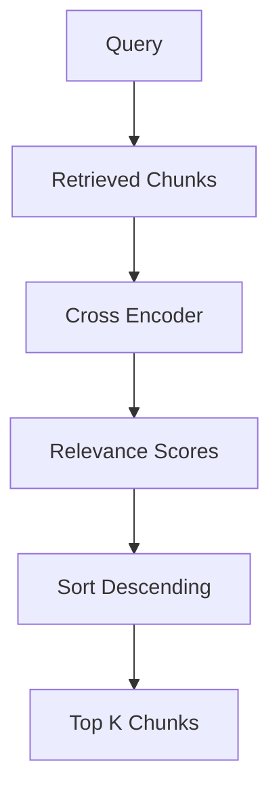
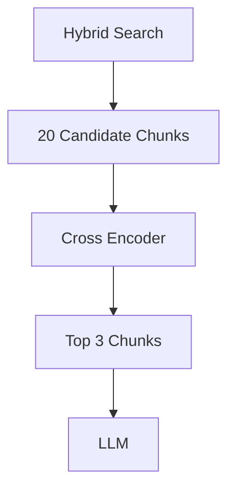

# 08 - Re-ranking in RAG

Re-ranking is a crucial step in the Retrieval-Augmented Generation (RAG) pipeline that refines retrieved documents to ensure the most contextually relevant chunks are presented to the Language Model (LLM).

---

## 🔍 What is Re-ranking?

Retrieval systems (like vector search or keyword-based search) prioritize **recall**—they aim to gather a broad set of potentially relevant chunks so that no critical information is missed. However, this often introduces noise (irrelevant chunks).

**Re-ranking** is the process of evaluating the exact relevance of each retrieved chunk against the user query and re-ordering them so that the absolute best answers are placed at the top.

In our project, retrieval is performed using a hybrid retrieval system (**Vector Search + BM25**), which outputs a list of candidate chunks. We then apply a **Cross-Encoder model** to compute a precise relevance score for each query-chunk pair and sort them accordingly.

---

## 💡 Why Do We Need Re-ranking?

Consider the query:
> **How do I manage state in React?**

Vector Search may retrieve:
* React was created by Facebook
* useState Hook
* Virtual DOM
* React Components

All are somewhat related to React.

However, only:
* **useState Hook**

directly answers the question.

Re-ranking helps identify the most relevant chunks and move them to the top.

---

## ⚖️ Retrieval vs Re-ranking

| Stage | Goal | Focus |
| :--- | :--- | :--- |
| **Retriever** | Do not miss relevant information. | Recall |
| **Re-ranker** | Select the best chunks. | Precision |

---

## 🤖 What Model Are We Using?

```python
CrossEncoder("cross-encoder/ms-marco-MiniLM-L-6-v2")
```

Unlike embedding models, a Cross Encoder reads the query and document together.

### Example:
* **Query**: *How do I manage state?*
* **Document**: *useState is a React Hook...*

The model predicts a relevance score.

---

## 🔄 Internal Flow



---

## ⚡ Why Is Re-ranking Expensive?

* **Vector Search**:
  `Query Embedding` $\rightarrow$ `Similarity Search` (Fast)

* **Cross Encoder**:
  `Query + Chunk` must be processed for every retrieved chunk (More accurate but slower).

---

## 🛠️ Project Implementation



---

## ❓ Interview Questions

1. What is Re-ranking?
2. Why is Re-ranking needed after retrieval?
3. Cross Encoder vs Embedding Model?
4. Recall vs Precision?
5. Why is Re-ranking more expensive?

---

## 🎯 Key Takeaway

> [!TIP]
> **Retrievers optimize recall while Re-rankers optimize precision.**